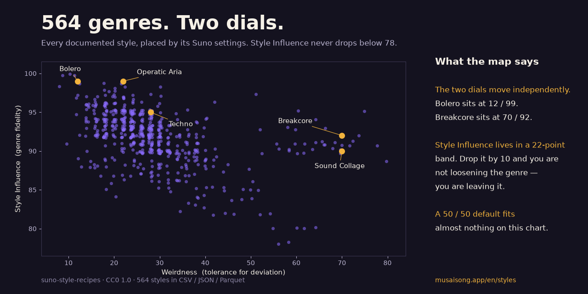

# Suno Style Recipes — 564 documented music styles with BPM, weirdness and style influence

**Try it in 30 seconds:** open the notebook in Colab, type a genre, get its prompt and settings — or give it a Weirdness / Style Influence pair and it returns the ten genres that live there.

If this saves you an afternoon of trial and error, a ⭐ helps other Suno users find it.

A reference catalogue of 564 music styles formatted for AI music generators (Suno, Udio). Each row gives the **style prompt** you paste into the "Style of Music" field, plus the three generation settings that actually change the output: **BPM**, **Weirdness** and **Style Influence**.

All 564 are in this repo, four ways:

- **[STYLES.md](STYLES.md)** — the complete table, readable in the browser. Start here if you only want to look one style up.
- **[styles.csv](styles.csv)** ([raw](https://raw.githubusercontent.com/samuelgrupolimex-prog/suno-style-recipes/main/styles.csv)) — one row per style, for a spreadsheet or a one-line `read_csv`. Columns: `style, family, bpm, weirdness, style_influence, style_prompt, structure, url`.
- **[styles.json](styles.json)** ([raw](https://raw.githubusercontent.com/samuelgrupolimex-prog/suno-style-recipes/main/styles.json)) — the same records with typed numbers and `null` where a style has no tempo, for anything that consumes it as an API.
- **[styles.parquet](styles.parquet)** ([raw](https://raw.githubusercontent.com/samuelgrupolimex-prog/suno-style-recipes/main/styles.parquet)) — columnar and compressed, 84 KB, for dataframe work at speed.

Also published as a dataset on Hugging Face: <https://huggingface.co/datasets/musaisong/suno-style-recipes>

Nine of the 564 are free-time and carry no BPM: the cell is empty in the CSV, `null` in the JSON and a dash in the table. Zero would be a false number, and a false number sinks any average you compute.

The 59 in the README below are the annotated subset: same numbers, plus a craft note on the one writing problem each genre creates. Every style also has a full page with its canonical song structure and a sample excerpt: <https://musaisong.app/en/styles>

**Disclosure:** I built and maintain the catalogue these come from. It is a paid product; this table is not — copy it, fork it, use it.

The table gives you the sound. The section "What the numbers don't tell you" gives you the part that decides whether the lyric works — one specific writing problem per style.

---

## How to use the three settings

Most people paste a style prompt and stop there. The three numbers do more work than the prompt does.

- **BPM** — set it explicitly. Left blank, the model averages toward 120 regardless of genre, which is why slow ballads come back sounding like mid-tempo pop.
- **Style Influence** (0–100) — how hard the model holds the genre. Below 85, hybrid genres collapse into their nearest mainstream neighbour. Above 95, the model refuses to deviate even when the lyric asks it to.
- **Weirdness** (0–100) — tolerance for deviation. Under 20 for anything ceremonial (wedding, bolero, opera). Over 50 only for genres whose identity *is* the deviation (breakcore, free jazz, sound collage).

The pattern worth noticing: **weirdness and style influence move independently.** Bolero sits at weirdness 12 / influence 99 — no deviation, maximum genre fidelity. Breakcore sits at 70 / 92 — maximum deviation, still high fidelity. A generic setting of 50/50 gives you the worst of both.

---

## The table — 59 annotated styles

| Style | Family | BPM | Weirdness | Style influence | Style prompt | Full page |
|---|---|---|---|---|---|---|
| Acid House | Machines That Dream | 125 | 30 | 92 | Acid House, squelchy resonant 303 bassline, punchy drum machine, hypnotic acid lines, retro rave energy, classic acid house, trippy and groovy | https://musaisong.app/en/style/acid-house |
| Ambient Techno | Machines That Dream | 120 | 32 | 90 | Ambient Techno, gentle steady kick, lush atmospheric pads, hypnotic minimal melodies, spacious dub textures, deep ambient techno, hypnotic and serene | https://musaisong.app/en/style/ambient-techno |
| Arena Anthem | Ballads That Break the Sky | 84 | 26 | 93 | Arena Anthem, big stadium drums, anthemic guitars, gang whoa-oh chants, huge uplifting vocals, festival singalong, euphoric and massive | https://musaisong.app/en/style/arena-anthem |
| Aria Operática | Hall of Centuries | 60 | 22 | 99 | Operatic Aria, full romantic orchestra, soaring dramatic soprano/tenor vocals, sweeping strings, grand dynamics, classical opera, majestic and devastating | https://musaisong.app/en/style/aria-operatica |
| Bachata Sensual | Rain Romance | 128 | 15 | 96 | Bachata, requinto guitar lead, bongó, güira, romantic sensual male vocals, Dominican guitar romance, smooth and danceable | https://musaisong.app/en/style/bachata-sensual |
| Big Room EDM | Machines That Dream | 128 | 24 | 90 | Big Room EDM, massive festival kick, huge anthemic synth leads, simple powerful drops, mainstage energy, big room house, huge and euphoric | https://musaisong.app/en/style/big-room-edm |
| Black Metal | Storm and Steel | 190 | 36 | 93 | Black Metal, tremolo-picked guitars, blast beats, raspy shrieked vocals, cold atmospheric texture, icy frostbitten metal, raw and majestic | https://musaisong.app/en/style/black-metal |
| Bolero Clásico | Rain Romance | 72 | 12 | 99 | Bolero, nylon guitar, soft strings, brushed percussion, velvet crooning male vocals, golden-age Latin romance, intimate and timeless | https://musaisong.app/en/style/bolero-clasico |
| Bossa Romántica | Rain Romance | 70 | 24 | 95 | Romantic Bossa Nova, nylon guitar, soft brushed drums, gentle piano, whispered intimate Portuguese vocals, Rio beach romance, breezy and sensual | https://musaisong.app/en/style/bossa-romantica |
| Breakcore | The Edge of the Map | 180 | 70 | 92 | Breakcore, frantic chopped amen breaks, distorted bass, hyperspeed drum edits, chaotic energy, intense and overwhelming, controlled mayhem | https://musaisong.app/en/style/breakcore |
| Chiptune Experimental | The Edge of the Map | 140 | 60 | 90 | Experimental Chiptune, 8-bit square waves, complex arpeggios, glitchy chip arrangements, retro-game textures pushed to extremes, nostalgic and frenetic | https://musaisong.app/en/style/chiptune-experimental |
| City Pop | Summer Sun | 112 | 22 | 95 | City Pop, funky bass, jazzy chords, bright horns, lush 80s production, smooth upbeat Japanese vocals, Tokyo summer groove, sophisticated and sunny | https://musaisong.app/en/style/city-pop |
| Cloud Rap | Street and Verse | 70 | 38 | 89 | Cloud Rap, ethereal hazy synths, reverb-drenched 808s, dreamy washed-out atmosphere, mumbled melodic flow, atmospheric trap, floaty and surreal | https://musaisong.app/en/style/cloud-rap |
| Country Ballad | Ballads That Break the Sky | 72 | 22 | 94 | Country Ballad, acoustic guitar, pedal steel, fiddle, warm storytelling vocals, Nashville heartbreak ballad, sincere and emotional | https://musaisong.app/en/style/country-ballad |
| Cumbia Norteña | The Party That Never Ends | 95 | 12 | 97 | Cumbia Norteña, accordion, bajo sexto, güira, steady cumbia beat, warm danceable male vocals, Mexican northern cumbia, festive and catchy | https://musaisong.app/en/style/cumbia-nortena |
| Dark Ambient | Breathing Silence | 55 | 50 | 86 | Dark Ambient, deep cavernous drones, subtle ominous textures, distant resonances, vast shadowy space, dark ambient, immersive and mysterious | https://musaisong.app/en/style/dark-ambient |
| Darkwave / EBM | Machines That Dream | 130 | 32 | 90 | Darkwave EBM, pulsing electronic body-music bass, cold drum machine, dark distorted synths, deep brooding vocals, gothic electronic, dark and driving | https://musaisong.app/en/style/darkwave-ebm |
| Deep House | Machines That Dream | 122 | 24 | 93 | Deep House, warm deep bassline, soft Rhodes chords, smooth vocal pads, laid-back groove, soulful deep house, warm and hypnotic | https://musaisong.app/en/style/deep-house |
| Digicore | The Edge of the Map | 150 | 62 | 90 | Digicore, glitchy hyperpop-rap fusion, autotuned emotional vocals, distorted 808s, gaming-era textures, internet-native, chaotic and heartfelt | https://musaisong.app/en/style/digicore |
| Doo-Wop | Rain Romance | 78 | 16 | 94 | Doo-Wop, vocal group harmonies, "bom bom" backing vocals, soft saxophone, brushed drums, 50s teenage romance, sweet and nostalgic | https://musaisong.app/en/style/doo-wop |
| Dreamgaze | Fog and Nostalgia | 100 | 40 | 89 | Dreamgaze, fusion of dream pop melody and shoegaze haze, soft ethereal vocals, lush guitar wash, hazy beauty, dreamy and overwhelming | https://musaisong.app/en/style/dreamgaze |
| Drill | Street and Verse | 145 | 26 | 93 | Drill, sliding 808s, dark sparse piano, skippy syncopated hi-hats, aggressive deadpan flow, UK/Chicago drill, menacing and cold | https://musaisong.app/en/style/drill |
| Drum & Bass | Machines That Dream | 174 | 28 | 94 | Drum and Bass, fast breakbeat drums, deep rolling sub bass, energetic synths, rave energy, liquid and neurofunk elements, fast and powerful | https://musaisong.app/en/style/drum-and-bass |
| Dubstep | Machines That Dream | 140 | 32 | 92 | Dubstep, heavy wobbling bass, half-time drums, aggressive growling synths, massive drops, brostep energy, heavy and explosive | https://musaisong.app/en/style/dubstep |
| Emo Anthem | Ballads That Break the Sky | 90 | 28 | 92 | Emo Anthem, distorted guitars, driving drums, raw cracking emotional vocals, pop-punk emotional anthem, cathartic and youthful | https://musaisong.app/en/style/emo-anthem |
| Epic Hybrid (Trailer) | Ballads That Break the Sky | 80 | 34 | 90 | Epic Hybrid Trailer, cinematic orchestra, hybrid electronic hits, choir, huge percussion, soaring wordless vocals, movie-trailer epic, overwhelming and heroic | https://musaisong.app/en/style/epic-hybrid-trailer |
| Eurodance | Machines That Dream | 138 | 24 | 89 | Eurodance, energetic synth stabs, four-on-the-floor beat, catchy female vocals and rap, euphoric 90s dance, fun and energetic | https://musaisong.app/en/style/eurodance |
| Folk Anthem | Ballads That Break the Sky | 96 | 24 | 92 | Folk Anthem, acoustic guitar, banjo, stomping kick, gang hey chants, building uplifting vocals, indie-folk singalong, warm and rousing | https://musaisong.app/en/style/folk-anthem |
| Free Jazz | The Edge of the Map | 140 | 60 | 93 | Free Jazz, collective improvisation, atonal sax skronk, frantic drums, walking-then-exploding bass, no fixed structure, ecstatic and chaotic | https://musaisong.app/en/style/free-jazz |
| Future Bass | Machines That Dream | 150 | 30 | 91 | Future Bass, lush detuned supersaw chords, pitched vocal chops, snappy drums, euphoric melodic drop, colorful future bass, bright and emotional | https://musaisong.app/en/style/future-bass |
| Gospel-Pop Ballad | Ballads That Break the Sky | 74 | 26 | 92 | Gospel-Pop Ballad, organ, piano, gospel choir backing, powerful melismatic vocals, uplifting build, soulful inspirational ballad, warm and transcendent | https://musaisong.app/en/style/gospel-pop-ballad |
| Heavy Metal | Storm and Steel | 140 | 24 | 97 | Heavy Metal, galloping twin guitars, thunderous double-kick drums, soaring powerful vocals, epic guitar solos, classic 80s heavy metal, mighty and triumphant | https://musaisong.app/en/style/heavy-metal |
| Hyperpop | The Edge of the Map | 160 | 60 | 95 | Hyperpop, distorted bass, pitched-up chipmunk vocals, glitchy maximalist production, sugary-aggressive synths, blown-out drums, chaotic and euphoric | https://musaisong.app/en/style/hyperpop |
| Hypnagogic Pop | Fog and Nostalgia | 95 | 42 | 89 | Hypnagogic Pop, warped tape-degraded synths, dreamlike half-remembered melodies, hazy vocals, surreal nostalgia, lo-fi hypnagogic, surreal and nostalgic | https://musaisong.app/en/style/hypnagogic-pop |
| Indie Anthem | Ballads That Break the Sky | 88 | 28 | 91 | Indie Anthem, chiming delay guitars, piano, building drums, atmospheric soaring vocals, festival indie-rock anthem, euphoric and expansive | https://musaisong.app/en/style/indie-anthem |
| Jangle Pop | Electric Roads | 130 | 26 | 90 | Jangle Pop, chiming 12-string guitars, melodic bass, bright drums, warm melodic vocals, sunny ringing hooks, 80s jangle pop, breezy and bright | https://musaisong.app/en/style/jangle-pop |
| Jazz Fusion | Smoke and Midnight | 130 | 34 | 92 | Jazz Fusion, virtuosic electric guitar and synths, complex grooves, funky bass, intricate solos, 70s jazz-rock fusion, virtuosic and electric | https://musaisong.app/en/style/jazz-fusion |
| K-Pop | Summer Sun | 120 | 24 | 95 | K-Pop, genre-blending production, sharp synths, trap and EDM drops, powerful polished Korean vocals and rap, hyper-catchy hooks, explosive and colorful | https://musaisong.app/en/style/k-pop |
| Metalcore | Storm and Steel | 160 | 28 | 93 | Metalcore, chugging breakdown riffs, screamed verses, melodic sung choruses, double-kick drums, modern aggressive metal, intense and dynamic | https://musaisong.app/en/style/metalcore |
| Musical Theatre Ballad | Ballads That Break the Sky | 72 | 26 | 93 | Musical Theatre Ballad, dramatic orchestra, theatrical building dynamics, powerful storytelling Broadway vocals, showstopper ballad, grand and emotive | https://musaisong.app/en/style/musical-theatre-ballad |
| Neo-Bolero | Rain Romance | 85 | 52 | 93 | Neo-Bolero, nylon guitar with modern production, ambient pads, subtle electronic textures, intimate breathy vocals, cinematic Latin romance, modern and atmospheric | https://musaisong.app/en/style/neo-bolero |
| Neo-Soul | Rain Romance | 82 | 38 | 90 | Neo-Soul, warm Rhodes piano, jazzy chords, loose live drums, rich melismatic vocals, organic and soulful, modern soul romance | https://musaisong.app/en/style/neo-soul |
| Nightcore | The Edge of the Map | 170 | 50 | 88 | Nightcore, sped-up pitched-up pop vocals, accelerated energetic beat, hyper-bright euphoric remix, anime-fan aesthetic, frenetic and sugary | https://musaisong.app/en/style/nightcore |
| Phonk | Street and Verse | 130 | 30 | 90 | Phonk, distorted cowbell, lo-fi Memphis rap vocal chops, heavy 808s, dark menacing atmosphere, drift-racing energy, gritty and hypnotic | https://musaisong.app/en/style/phonk |
| Piano Ballad | Ballads That Break the Sky | 70 | 24 | 94 | Piano Ballad, solo grand piano, subtle strings, intimate then powerful vocals, emotional singer-songwriter ballad, raw and moving | https://musaisong.app/en/style/piano-ballad |
| Power Ballad | Ballads That Break the Sky | 72 | 51 | 97 | Power Ballad, soaring electric guitar solo, big drums, lush strings, massive belting vocals, 80s arena rock ballad, explosive and emotional | https://musaisong.app/en/style/power-ballad |
| Qawwali | Distant Worlds | 100 | 28 | 97 | Qawwali, harmonium, tabla, dholak, hand claps, ecstatic call-and-response Sufi vocals, building to trance, Pakistani devotional, overwhelming and transcendent | https://musaisong.app/en/style/qawwali |
| R&B Ballad | Ballads That Break the Sky | 70 | 26 | 91 | R&B Ballad, lush keys, layered harmonies, deep bass, melismatic emotional vocals, contemporary R&B power ballad, smooth and soaring | https://musaisong.app/en/style/rnb-ballad |
| Reggaetón Romántico | Rain Romance | 92 | 25 | 90 | Romantic Reggaetón, soft dembow, melodic 808s, autotuned tender vocals, catchy emotional hooks, Latin urban romance, smooth and danceable | https://musaisong.app/en/style/reggaeton-romantico |
| Rock Anatolio (Psych) | Distant Worlds | 110 | 34 | 92 | Anatolian Psych Rock, electric saz, fuzz guitar, organ, Turkish folk melodies, psychedelic groove, hypnotic and gritty | https://musaisong.app/en/style/anatolian-psych-rock |
| Sadcore | Fog and Nostalgia | 70 | 38 | 92 | Sadcore, melancholic slow guitars, soft piano, mournful tender vocals, downbeat atmosphere, sad slow indie, melancholic and intimate | https://musaisong.app/en/style/sadcore |
| Shibuya-kei | Summer Sun | 116 | 30 | 92 | Shibuya-kei, lounge samba samples, bossa guitar, vintage strings, breezy stylish Japanese vocals, retro-chic Tokyo pop, sophisticated and playful | https://musaisong.app/en/style/shibuya-kei |
| Shoegaze | Fog and Nostalgia | 100 | 42 | 96 | Shoegaze, walls of reverb-drenched distorted guitars, buried ethereal vocals, dreamy melodic bass, hazy wash of sound, classic shoegaze, overwhelming and beautiful | https://musaisong.app/en/style/shoegaze |
| Soul Ballad | Ballads That Break the Sky | 68 | 22 | 93 | Soul Ballad, warm organ, horns, gospel-tinged backing, deeply emotive powerful vocals, classic soul heartbreak ballad, raw and moving | https://musaisong.app/en/style/soul-ballad |
| Sound Collage | The Edge of the Map | — | 70 | 90 | Sound Collage, layered spoken word, field recordings, radio static, juxtaposed audio fragments, tape experiment, surreal and narrative | https://musaisong.app/en/style/sound-collage |
| Synthwave | Machines That Dream | 110 | 28 | 93 | Synthwave, retro analog synths, gated reverb drums, arpeggiated basslines, nostalgic 80s neon atmosphere, cinematic retrowave, dreamy and driving | https://musaisong.app/en/style/synthwave |
| Techno | Machines That Dream | 132 | 28 | 95 | Techno, driving relentless kick, hypnotic synth loops, dark industrial textures, minimal evolving arpeggios, Berlin techno, hypnotic and powerful | https://musaisong.app/en/style/techno |
| Trap | Street and Verse | 140 | 24 | 95 | Trap, booming 808 bass, rapid hi-hat rolls, dark menacing synths, confident triplet flow, Atlanta trap, hard and atmospheric | https://musaisong.app/en/style/trap |
| Vaporwave | Machines That Dream | 80 | 40 | 89 | Vaporwave, slowed-down chopped 80s samples, lush nostalgic synths, dreamy reverb, surreal mall-music atmosphere, vaporwave, nostalgic and surreal | https://musaisong.app/en/style/vaporwave |

---

## Extremes worth knowing

- **Slowest:** Dark Ambient (55) · Operatic Aria (60) · Soul Ballad (68)
- **Fastest:** Black Metal (190) · Breakcore (180) · Drum & Bass (174) · Nightcore (170)
- **Lowest weirdness:** Bolero Clásico (12) · Cumbia Norteña (12) · Bachata Sensual (15) · Doo-Wop (16) — ceremonial and traditional genres punish deviation
- **Highest weirdness:** Breakcore (70) · Sound Collage (70) · Hyperpop (60) · Free Jazz (60) · Digicore (60)
- **Highest style influence:** Operatic Aria (99) · Bolero Clásico (99) · Cumbia Norteña (97) · Qawwali (97) · Heavy Metal (97) · Power Ballad (97)

## What the numbers don't tell you

The three settings get you the sound. They don't get you the lyric — and the lyric is where most AI songs fall apart, because the model will happily write a technically correct chorus that any genre could have produced.

Each style below has one specific writing problem that the settings can't solve. One line each, taken from the craft notes on the full pages.

- **Ambient Techno** — That is the surface, and in a genre where almost nothing happens, the surface is almost everything visible and almost nothing that matters. [Full craft note →](https://musaisong.app/en/style/ambient-techno)
- **Bachata Sensual** — In bachata sensual the lyric walks a ledge: one centimetre too far and it's vulgar, one too short and it's any ballad. [Full craft note →](https://musaisong.app/en/style/bachata-sensual)
- **Big Room EDM** — How to keep a chant from sounding hollow when repeated a thousand times, and how to pace the synth tension so the drop feels like physical release rather than flat noise. [Full craft note →](https://musaisong.app/en/style/big-room-edm)
- **Black Metal** — How to sustain lyrical tremolo without monotony, or how to write hostile wilderness so it sounds like annihilation rather than a postcard. [Full craft note →](https://musaisong.app/en/style/black-metal)
- **Bolero Clásico** — How to write a bolero today without sounding like an imitation: which exact word fits a line so slow every syllable is heard whole, how much silence a phrase carries before losing the listener, how to declare without adjectives. [Full craft note →](https://musaisong.app/en/style/bolero-clasico)
- **Chiptune Experimental** — How to make the obsessive repetition of a square wave suffocating rather than monotonous, and where a glitch stops being a digital gimmick and becomes an open wound. [Full craft note →](https://musaisong.app/en/style/chiptune-experimental)
- **City Pop** — The precise angle of detachment: how many degrees of cool keep sophistication from sounding like disdain, and how to make an upbeat lyric maintain an edge without slipping into generic cheer. [Full craft note →](https://musaisong.app/en/style/city-pop)
- **Cloud Rap** — How much can be left unfinished before it stops meaning anything, how to write a line so it sounds dragged rather than careless, when Spanglish is natural and when it's costume. [Full craft note →](https://musaisong.app/en/style/cloud-rap)
- **Cumbia Norteña** — In cumbia norteña the lyric is harder than it looks, because a badly written party sounds like a beer advert. [Full craft note →](https://musaisong.app/en/style/cumbia-nortena)
- **Dark Ambient** — How to sustain emotional tension for four minutes without a single chord change, and how to keep spatial descriptions physical rather than literary. [Full craft note →](https://musaisong.app/en/style/dark-ambient)
- **Darkwave / EBM** — Keeping the coldness from sounding like a prop and ensuring the hypnotic repetition never flatlines into boredom. [Full craft note →](https://musaisong.app/en/style/darkwave-ebm)
- **Deep House** — Two writing pitfalls this genre punishes instantly: sliding into cheap sentimentality when describing the night, or breaking the trance with glaring rhymes that shatter the hypnotic loop. [Full craft note →](https://musaisong.app/en/style/deep-house)
- **Digicore** — How to make digital distortion sound like raw vulnerability rather than a cheap preset, and how to structure lyrics so that screen terminology does not drown out the emotional punch. [Full craft note →](https://musaisong.app/en/style/digicore)
- **Doo-Wop** — How to make innocence sound true instead of like a school-play costume, and how to balance the exact breath between vocal harmonies so the lyric never loses the rhythm of sneakers on asphalt. [Full craft note →](https://musaisong.app/en/style/doo-wop)
- **Dreamgaze** — The hard part isn't the sound: it's writing a lyric that holds up when the words are going to arrive half-veiled. [Full craft note →](https://musaisong.app/en/style/dreamgaze)
- **Drill** — How many objects per verse before the list loses tension, where the silence goes that forces the listener to fill in, how to deliver a hyperbole in a flat tone without it sounding like a joke. [Full craft note →](https://musaisong.app/en/style/drill)
- **Dubstep** — How to stretch a vowel across a wobble without sounding ridiculous against the heavy sub-bass, and how to calibrate the exact silence before the drop so the pause hurts more than the blow. [Full craft note →](https://musaisong.app/en/style/dubstep)
- **Emo Anthem** — How to maintain visceral tension without sliding into cheap self-pity, and exactly where to place the vocal crack so it never sounds like acting. [Full craft note →](https://musaisong.app/en/style/emo-anthem)
- **Epic Hybrid (Trailer)** — Preventing grandiloquence from collapsing into empty noise and keeping the orchestra from drowning out the truth of your story. [Full craft note →](https://musaisong.app/en/style/epic-hybrid-trailer)
- **Eurodance** — How to calibrate syncopated rap so it never feels like filler, and how to keep the sweet vocals from slipping into unbearable cheese. [Full craft note →](https://musaisong.app/en/style/eurodance)
- **Folk Anthem** — Keeping the lyrics from sounding like a summer camp manual that breeds cynicism, and making sure the communal chorus grows from a concrete experience rather than a marketing slogan. [Full craft note →](https://musaisong.app/en/style/folk-anthem)
- **Free Jazz** — Translating reckless acoustic chaos into sharp text without sliding into gibberish, and sustaining visceral tension across a song without relying on regular meters or stock rhymes. [Full craft note →](https://musaisong.app/en/style/free-jazz)
- **Future Bass** — How to keep euphoria from sounding like a self-help manual, and how to prevent chromatic synesthesia from falling into advertising clichés. [Full craft note →](https://musaisong.app/en/style/future-bass)
- **Gospel-Pop Ballad** — How far a vowel can stretch before sentimentality turns into formula, and how to build the harmonic ascent so the choir sounds like a true revelation instead of filler. [Full craft note →](https://musaisong.app/en/style/gospel-pop-ballad)
- **Hyperpop** — Where to break a line so the glitch means something, how much sweetness a verse carries before it cloys, how to write euphoria with sadness underneath without explaining it. [Full craft note →](https://musaisong.app/en/style/hyperpop)
- **Indie Anthem** — How to keep the chorus from sounding like empty yelling instead of actual release, and where to drop the silence right before the build so the guitar cuts through cleanly. [Full craft note →](https://musaisong.app/en/style/indie-anthem)
- **Jangle Pop** — How to make a melody sound luminous without falling into advertising clichés, and how to pack a piercing nostalgia into verses so short they feel ready to snap. [Full craft note →](https://musaisong.app/en/style/jangle-pop)
- **Jazz Fusion** — How to keep technical virtuosity from drowning out human emotion, and how to make a thirteen-chord progression sound like raw urgency rather than a music theory lecture. [Full craft note →](https://musaisong.app/en/style/jazz-fusion)
- **K-Pop** — How to pull off five gear shifts in three minutes without losing the thread, and how to make the chorus explode upward when the listener already thought the volume ceiling had been reached. [Full craft note →](https://musaisong.app/en/style/k-pop)
- **Metalcore** — How to keep the melodic chorus from sounding like soft pop after a blast of blind violence, and how to make the breakdown hit like a blunt object without falling into empty clichés. [Full craft note →](https://musaisong.app/en/style/metalcore)
- **Musical Theatre Ballad** — How to keep high drama from tipping into parody when the brass swells, and how to pace the breath so the jump from spoken verse to unyielding belt feels earned rather than forced. [Full craft note →](https://musaisong.app/en/style/musical-theatre-ballad)
- **Neo-Soul** — How to stretch a vowel with a melisma without sounding like empty ornamentation, and how to name routine without falling into boredom. [Full craft note →](https://musaisong.app/en/style/neo-soul)
- **Nightcore** — How to modulate vocal frequencies at that speed without sacrificing clarity, and the exact craft required to keep the euphoria from sounding hollow or forced. [Full craft note →](https://musaisong.app/en/style/nightcore)
- **Phonk** — How often a chop repeats before it hypnotises rather than bores, how to write menace without naming it, when the car stops being a car and becomes the body of whoever is singing. [Full craft note →](https://musaisong.app/en/style/phonk)
- **Piano Ballad** — Precisely how many seconds of silence to leave before the listener feels the song is dying, and the exact weight of a high-pitched word so it avoids cheap melodrama. [Full craft note →](https://musaisong.app/en/style/piano-ballad)
- **Power Ballad** — How tension is held across the first sixteen bars without falling into early screaming, and the exact distance between a bedroom confession and the chorus that shakes the top balcony. [Full craft note →](https://musaisong.app/en/style/power-ballad)
- **Qawwali** — How to stretch a single phrase for ten minutes without losing the listener, and how to make a vocal peak sound like revelation instead of shouting. [Full craft note →](https://musaisong.app/en/style/qawwali)
- **R&B Ballad** — Timing the vocal runs precisely where plain words run out of weight, and turning everyday objects into dramatic landmarks without turning melodramatic. [Full craft note →](https://musaisong.app/en/style/rnb-ballad)
- **Reggaetón Romántico** — How to make a love lyric sound like the street instead of a cheap postcard, and how to write melodies that carry pitch correction without losing the weight of everyday speech. [Full craft note →](https://musaisong.app/en/style/reggaeton-romantico)
- **Shibuya-kei** — How to make a verse speak of a breakup without using a single sad word, and how to insert a reference to an everyday object without sounding like cheap advertising. [Full craft note →](https://musaisong.app/en/style/shibuya-kei)
- **Shoegaze** — How to maintain lyrical tension when the vocal is buried so deep it loses its anchor, and how to prevent a pile-up of melancholic imagery from turning into a flat postcard. [Full craft note →](https://musaisong.app/en/style/shoegaze)
- **Soul Ballad** — How to keep pain from sounding like cheap melodrama, and how to make a mundane object — a glass, a chair, a coat — carry the full fury of a loss without sliding into sentimentality. [Full craft note →](https://musaisong.app/en/style/soul-ballad)
- **Techno** — How to keep lines from sounding like empty political slogans when you aim for industrial detachment, and how to sustain tension across a repetitive text loop without sliding into lazy phrasing. [Full craft note →](https://musaisong.app/en/style/techno)
- **Trap** — How many words carry weight per verse before coldness becomes pose, on which exact line the mask is allowed to slip, how to name power without explaining it. [Full craft note →](https://musaisong.app/en/style/trap)
- **Vaporwave** — How a standard time signature is warped so that time itself appears to dissolve, and the precise distance required to place a vocal so it sounds like a ghost behind a tiled wall. [Full craft note →](https://musaisong.app/en/style/vaporwave)

## By family

- **Machines That Dream** — Synthwave, Techno, Deep House, Acid House, Ambient Techno, Drum & Bass, Dubstep, Future Bass, Eurodance, Big Room EDM, Darkwave/EBM, Vaporwave
- **Ballads That Break the Sky** — Power Ballad, Piano Ballad, Soul Ballad, R&B Ballad, Country Ballad, Gospel-Pop Ballad, Musical Theatre Ballad, Arena Anthem, Indie Anthem, Emo Anthem, Folk Anthem, Epic Hybrid (Trailer)
- **Rain Romance** — Bolero Clásico, Neo-Bolero, Bachata Sensual, Bossa Romántica, Doo-Wop, Neo-Soul, Reggaetón Romántico
- **The Edge of the Map** — Breakcore, Hyperpop, Digicore, Nightcore, Free Jazz, Sound Collage, Chiptune Experimental
- **Fog and Nostalgia** — Sadcore, Shoegaze, Dreamgaze, Hypnagogic Pop
- **Street and Verse** — Trap, Drill, Phonk, Cloud Rap
- **Storm and Steel** — Heavy Metal, Black Metal, Metalcore
- **Summer Sun** — K-Pop, City Pop, Shibuya-kei
- **Distant Worlds** — Qawwali, Anatolian Psych Rock
- **Smoke and Midnight** — Jazz Fusion
- **Breathing Silence** — Dark Ambient
- **The Party That Never Ends** — Cumbia Norteña
- **Hall of Centuries** — Operatic Aria
- **Electric Roads** — Jangle Pop

---

## All 564 styles

| File | Shape | Use it for |
|---|---|---|
| [STYLES.md](STYLES.md) | Markdown table | Reading and looking one style up |
| [styles.csv](styles.csv) | 565 lines, 8 columns | Spreadsheets, `read_csv`, quick greps |
| [styles.json](styles.json) | Typed records, `null` tempos | Feeding an app or an API |
| [styles.parquet](styles.parquet) | Columnar, 84 KB | Dataframes and analytics |

All four are regenerated from the source catalogue by [a scheduled workflow](.github/workflows/sync-catalogue.yml), so none of them drifts from the others. Mirrored as a dataset on [Hugging Face](https://huggingface.co/datasets/musaisong/suno-style-recipes).

Three write-ups read the corpus as data rather than as a lookup table:

- **[ANALYSIS.md](ANALYSIS.md)** — what 564 documented genres reveal about how the three settings actually behave, including the measurement that contradicts the advice everyone repeats.
- **[ANALYSIS-2.md](ANALYSIS-2.md)** — the nine genres where BPM does not apply, why a zero in that field is worse than an empty one, and what replaces the meter when there is no pulse to write against.
- **[ANALYSIS-3.md](ANALYSIS-3.md)** — the 47 artist, composer and brand names the style prompts used to carry, what replaced each one, and a four-part method to do the same in your own prompts.

Each style also has a full page carrying its structure, a craft note on how its lyrics behave, and a sample excerpt: <https://musaisong.app/en/styles>

## Where this data comes from

This catalogue is the reference layer behind [MUSAI](https://musaisong.app/en) — it writes original lyrics from a personal story and delivers the finished sung song, plus the style recipe above and a numbered illustrated art plate with a public record.

The data here is CC0 and open to use on its own. If you want the words written for you:

- All 564 documented styles → https://musaisong.app/en/styles
- A finished example → https://musaisong.app/example/the-trowel-and-the-sword
- Lyrics + sung song, from $5 → https://musaisong.app/en/plans

## Want the lyrics written for you?

This table gives you the sound. If you also want the words and the finished song — original lyrics written from your own story, the sung track ready to play and download, plus a numbered illustrated plate with a public record — that's what I built MUSAI for.

**Disclosure:** MUSAI is mine and it is paid. Everything above this section stays public domain (CC0).

- Launch week: the first 10 people who use code MUSAI-ESTRENO on the 1-song link get it as a courtesy song.
- **1 lyric — $5, one-time** — https://buy.stripe.com/dRm00ldvx97WcKr8M93wQ07
- **10 lyrics — $15, one-time** — https://buy.stripe.com/3cIeVf2QT6ZOfWDbYl3wQ08
- **50 lyrics a month — $39** — https://buy.stripe.com/fZuaEZ2QTgAocKr4vT3wQ06

The 50/month plan can be cancelled anytime. One-time packs are a single charge. If a lyric fails, that lyric is redone or refunded. MUSAI writes the lyrics and delivers the sung song; the style recipe below is the open, public-domain layer.

## Contributing

Found a setting that works better? Open an issue with the style, the numbers you used and what changed. Corrections welcome.

## License

Everything in this repo — the table in this README, `STYLES.md`, `styles.csv`, `styles.json` and `styles.parquet` — is released under CC0 1.0, public domain. Use it anywhere, no attribution required.
